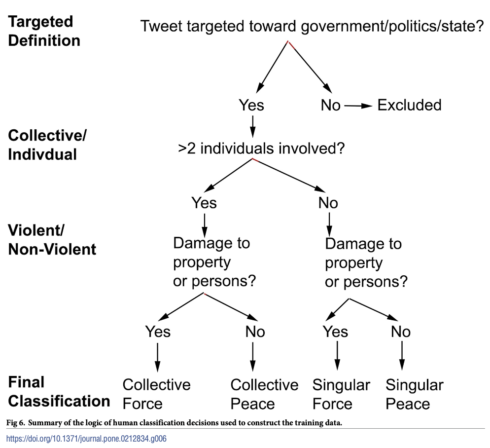

# Introduction

After learning of Darwin's theory of evolution in the 19th century, the Bishopess of Worcester famously responded, "let us hope that it is not true, but if it is, let us pray that it will not become generally known." ^[https://www.washingtonpost.com/archive/politics/1982/11/27/darwin-without-the-ism/93a3e9ab-49ce-4db8-b67a-4fd2682d2af3/] Though the publication of Darwin's theories were likely a net positive for humanity, I believe the Bishopess' reservations demonstrate an interesting normative concern for science communication: we have no control over the truth, but what obligations do we have to disseminate or even withhold information we believe could be damaging to public life. In this case, the answer seems easy --- the utilitarian would argue that there is a clear benefit to a well-educated public and surely a deontologist would find that providing new information to the public prevents a state from using them as mere means to an end --- Yes. The dissemination of the theory of evolution was necessary. But in this proposal, I intend to present a paper that complicates this issue. This paper^[Anastasopoulos LJ, Williams JR (2019) "A scalable machine learning approach for measuring forceful and peaceful forms of political protest participation with social media data." PLoS ONE 14 (3): e0212834. https://doi.org/10.1371/journal.] proposes a method utilizing machine learning to determine participation in political protests, both forceful and peaceful. They then propose creating a public database to aid academic pursuits.

# Summary of Method
The authors attempt to develop a classification model that can determine whether a tweet constitutes political participation and whether the actions associated with that tweet are violent or non-violent and collective or individual. They define "political participation" using the following five rules:  
  
1. "Are we dealing with behavior?  
2. Is the activity voluntary?  
3. Is the activity done by citizens?  
4. Is the activity loacated in the sphere of government/state/politics?  
5. Is the activity targeted at the sphere of government/state/politics?"^[Anastasopoulos LJ, Williams JR (2019), 6]
  
They define a tweet as signifying political participation^[They provide both a "minimal" and "targeted" definition, but only use the latter in their model, so I'll refer only to the targeted definition] if that tweet satisfies rules 1,2,3 and 5, but not 4, in the above list.  

They then use the following criterion to determine whether the action associated with the tweet was "forceful:" does the action "immediately inflict physical damage on persons and/or objects?"^[Anastasopoulos & Williams (2019), 6].  

Finally, they determine whether an action was individual or collective based on the following two criteria:  

1. The action "involves at least two perpetrators of damage"  
2. The action "results at least in part from coordination among persons" ^[Anastasopoulos & Williams (2019), 6]

These classification rules are summarized by this decision tree:
^[Anastasopoulos & Williams (2019), 10]

The authors then use a filter to refine over 600 million geo-tagged tweets to 184,626 identified as being "more likely... to be related to protest activity"^[Anastasopoulos & Williams (2019), 11]. They then manually classify 10% of this sample, using the classification rules enumerated earlier. They then train four Bayes classifiers (one four each category in the above picture) on the text data of those manually classifed tweets. These Bayes classifiers were modified using "a recently developed multiword expression segmentation method which bases... classifiers on integrated collections of words and phrases" --- essentially, the algorithm can tell the difference between "tear gas" as a phrase and "tear"/"gas" as separate words.^[Anastasopoulos & Williams (2019), 13]. These classifiers are then applied to the all of the 184,626 tweets and evaluate the model's performance "by performing a tenfold cross-validation on the coded tweets data set."^[Anastasopoulos & Williams (2019), 13].

The authors report that the model accurately classifies tweets 80.71% of the time, but performs less well on specific kinds of classification: for example, the model will classify collective peaceful actions correctly only 51.92%.^[Anastasopoulos & Williams (2019), 16] The model seems to perform best on collective forceful and individual peaceful actions (74.08% and 73.52%, respectively); it performs worst on collective peaceful and individual forceful actions (51.92% and 57.39%).

# Normative Consideration
The authors point out that media have historically tended to focus on violent rather than non-violent protests, thus contributing to a skewed perception of dissent by scholars, politicians, and the public. They suggest that an accurate database constructed using readily available social media (Twitter/X in this case) data would be invaluable to academics. But, of course, these data and this method are necessarily open-source. Once again, one could make the argument that such a development would satisfy utilitarian and deontological concerns: media and politicians will no longer be able to misconstrue the character of political dissent, constituting a societal benefit; additionally, in these mischaracterizations of political actions, politicians and media use people as means to ends, so preventing them from doing so should be ethical. However, what about more difficult contexts where rights to dissent ar not as secure. This paper published information on participation in a Hong Kong protest; information which would be available to, for example, the Chinese Communist Party. The reality is that this information and the methods of processing it can enable bad actors to harm people more efficiently. This suggests an alternative but related question to the ethics of disseminating information: to what degree are academics responsible for the harm done to people by bad actors using said academics' data and methods?

My primary concern with this paper is on the privacy of data. The model uses geographical data from these tweets and the authors acknolwedge that these data came either from users who either "actively wanted their location tracked or were unaware that their location was being tracked and did not turn location services off." ^[Anastasopoulos & Williams (2019), 12] The authors acknowledge, then, that at least some portion of this research's subjects did not give _informed_ consent for their data to be published at all, let alone used in an academic context. The authors actually consistently take a relaxed tone toward data privacy in much of the paper. They consistently use the passive voice to describe the publication of data --- they write that "massive quantities of social media data are publicly available" rather than, for example, "social media companies publish massive quantities of personal data."^[Anastasopoulos & Williams (2019), 2]. I would like to reiterate my concern that these data and methods could potentially be used bad actors (e.g., authoritarian states) to cause people real harm, but these authors seem to consider only the _positive_ applications of their work. Additionally they speculate about the possibility of applying the model to real-time data. While in an ideal world this would allow law enforcement to quell violent actions more efficiently, it would also provide the state with detailed information about the location and extent of _any_ political protest as well as the individuals involved. Equipping an authoritarian state with these abilities could have disastrous consequences and, while I personally believe that services collecting personal data (i.e., social media companies) should the burden of protecting data, until that happens, we must have a discussion about whether the development of such algorithms is ethical.

